A collection of tools and techniques for creating boundaries from PDF and other public documents to seed a national dataset of conservation area boundaries:

[https://planning.data.gov.uk/dataset/conservation-area](https://planning.data.gov.uk/dataset/conservation-area)

See also: https://digital-land.github.io/barnet-conservation-areas/

# Licence

The software in this project is open source and covered by the [LICENSE](LICENSE) file.

Individual datasets copied into this repository may have specific copyright and licensing, otherwise all content and data in this repository is
[© Crown copyright](http://www.nationalarchives.gov.uk/information-management/re-using-public-sector-information/copyright-and-re-use/crown-copyright/)
and available under the terms of the [Open Government 3.0](https://www.nationalarchives.gov.uk/doc/open-government-licence/version/3/) licence.

# Methods

This section summarised the results of two different approaches to extracting geographical data:

* Python approach - testing automation using some python scripts
* Manual approach - testing manual georeference and polygon tracing

Summary of the advantages and challenges to each approach, before more step-by-step detail on each one.

**Python approach**    

Advantages:
* Could possibly be used to automate parts of processing all of an LPAs conservation areas in a batch (e.g. extracting relevant pdf pages from appraisal docs, processing images to extract a trace of the area, converting an image line to a vector)
* Would ensure a more standardised approach to geometry creation

Challenges:  
* Still requires some manual inputs and steps for each area (e.g. identifying the colour of the area to assist extraction, image tidying in Gimp, geo-referencing the image)
* Would likely still require a quality review of vectors produced in a semi-automated way
There will likely be some areas which are impossible to process in an automated way (e.g. where the map and outline is in black and white meaning extracting it would be very difficult)  

**Manual approach**  

Advantages:
* Finer control over how to represent complicated area boundaries in vector format
* Retaining the map in the image makes geo-referencing easier as it means there are many features to cross-reference with the basemap being used  

Challenges:
* Time consuming process, estimate is between 1.5-2 hours per area

## Python approach

**Extracting geographical data from images**

**Author: Dave K Brown,** *david.brown4@communities.gov.uk*

**Date: 30<sup>th</sup> July 2024**

This document explains how to extract a bounded area in a graphic image
(e.g. PNG, JPG) so that geographical data can be created.

**Tools used:**

Python3 with libraries of: OpenCV, matplotlib, numby

JuypterLab

Gimp

QGis and the QGis python console and QuickMapServices

**Setup Steps:**

1.  Download and install python3

> C:\\&gt; python3 --version

> Python 3.10.11
```
> python3 --version

> Python 3.10.11
```

2.  Download and install JuypterLab. Version 3.6.3

3.  Download QGIS, Version 3.34.8-Prizren

4.  Create a new QGIS project;

        Add \\\\Web\\QuickMapServices\\OSM OSM Standard

        Set EPSG:3857 – WGS 84 / Pseudo-Mercator (???)

5.  If needed, install additional python libraries into QGIS

To check for which libraries are already installed use:
```

import pkg\_resources

installed\_packages = pkg\_resources.working\_set

installed\_packages\_list = sorted(\["%s==%s" % (i.key, i.version) for i
in installed\_packages\])

for p in installed\_packages\_list:

print(p)
```

To install libraires into QGIS use:
```

pip.main(\['install', 'shapely'\])
```

6.  Create a file structure as shown below:

> Phase1\\BaseImages
>
> \\FinalPolygon
>
> \\bin

7.  Add the following files to the bin directory;

> Phase1\\bin\\makeWhiteTransparent.bat
>
> Phase1\\bin\\pullLineFromPDF\_2.ipynb
>
> Phase1\\bin\\ReadCSVtoPolygon\_1.py

**Production Steps:**

1.  Create a JPG or PNG of the best map of the conservation area, using
    a screen shot,

2.  Using Gimp find colour of highlighted area,

3.  Alter python3 script to look for the file and the colour found
    above,

4.  Using JupyterLab, run the image through OpenCV to extract a trace of
    the area,

5.  Tidy image in Gimp if needed, remove spurs and spurious features,

6.  Run trace image through gimp to make background transparent,

7.  Georeference in Qgis, at least four points,

8.  In QGis convert line to vectors,

9.  Run QGis python on vectors to thicken and close gaps,

10. Import Polygon into QGIS

These production steps are detailed below:

1.  **Create a JPG or PNG of the best map of the conservation area,
    using a screen shot,**

    1.  Source the best online image we can find, Column D of the “**Conservation Area List**” in the Areas GoogleSheet, <https://docs.google.com/spreadsheets/d/1r96ruDklYhgm0m0mASR2Bsxc7KE59FQ1>

    2.  Take a screenshot and save the base Image as `Phase1\\BaseImages\\ConservationArea\_NNNN.png`

2.  **Using Gimp find colour of highlighted area**

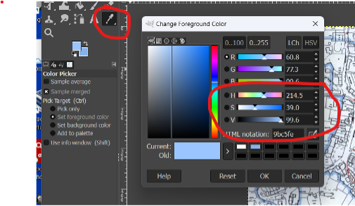

Record the figures, Hue (H), Saturation (S) and Value (V).

3.  **Alter python3 script to look for file and the colour found above**

Within the JuypterLab script look for the two sections below:

```
14 DIR = "C:\\\\Users\\\\DavidBrown\\\\Documents\\\\GIS\\\\
Phase1\\\\BaseImages"

15 fileName = "\\\\ConservationArea\_NNNN.png"
```

```
31 gimpH = 217

32 gimpS = 29

33 gimpV = 95
```

The basic tolerance is preset but can easily be altered:
```
30 tolerance\_percent = 2
```
4.  **Using JupyterLab, run the image through OpenCV to extract a trace of the area**

The script can be amended in many ways, certainly the tolerance can be
altered.

But also many parameters within the extract\_lines function.

Stop when you have an acceptable line trace.

Initial Image

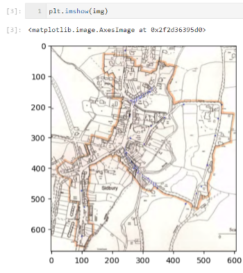

After “extract\_edges function” Image

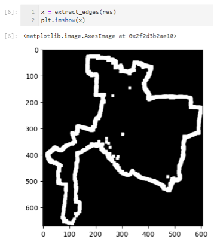

Final Image

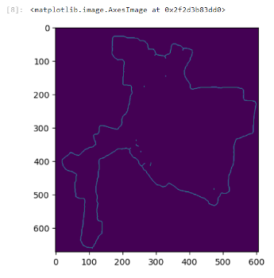

The output file will be named:

. . . \\Phase1\\BaseImages\\img\_ConservationArea\_NNNN.png

5.  **Tidy image in Gimp if needed, remove spurs and spurious
    features.**

Open image in Gimp and tidy it.

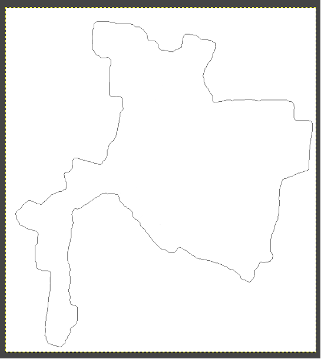

Save it as
“Phase1\\BaseImages\\cleaned\_img\_ConservationArea\_NNNN.png”

6.  **Run trace image through gimp to make background transparent**

```
> PS C:\\Users\\DavidBrown\\Documents\\GIS\\beer&gt;
> .\\makeWhiteTransparent.bat &gt; mWT.log 2&gt;&1
>
> "C:\\Users\\DavidBrown\\AppData\\Local\\Programs\\GIMP
> 2\\bin\\gimp-2.10.exe" -i -b "( let\* ( ( image ( car (file-png-load 1
> \\"C:/Users/DavidBrown/Documents/GIS/beer/beer\_line\_only.png\\"
> \\"C:/Users/DavidBrown/Documents/GIS/beer/beer\_line\_only.png\\" ) )
> ) ( drawable ( car (gimp-image-active-drawable image ) ) ) ) (
> plug-in-colortoalpha 1 image drawable '(255 255 255) ) (
> gimp-file-save RUN-NONINTERACTIVE image drawable
> \\"C:/Users/DavidBrown/Documents/GIS/beer/\_beer\_line\_only.png\\"
> \\"C:/Users/DavidBrown/Documents/GIS/beer/\_beer\_line\_only.png\\")
> )" -b "(gimp-quit 0)"
```
The following is **suppressed** by using the 2&gt;&1 at the end of the command.
```
> using gegl copy
>
> batch command executed successfully
>
> C:\\Users\\DavidBrown\\AppData\\Local\\Programs\\GIMP
> 2\\bin\\gimp-2.10.exe: GEGL-WARNING:
> (../gegl-0.4.48/gegl/buffer/gegl-tile-handler-cache.c:1076):gegl\_tile\_cache\_destroy:
> runtime check failed: (g\_queue\_is\_empty (&cache\_queue))

1.  EEEEeEeek! 3 GeglBuffers leaked

> (Type any character to close this window)
```

7.  **Georeference in Qgis, at least four points**

<!-- -->

1.  Open QGIS project

2.  Navigate to
    `\\\\Layer\\georeferencer`

3.  Click on the Open Raster top menu button and navigate to the file
    created above:
    `Phase1\\BaseImages\\\_cleaned\_img\_ConservationArea\_NNNN.png`

4.  Using the original image georeference at least four points

    1.  Add Point,

    2.  Click on image, then click on same place on base map in QGIS,

    3.  Repeat,

    4.  Click the green play button,

    5.  Accept the default output file name,

    6.  Press green button again

    7.  Save the points file to . . .

<!-- -->

8.  **In QGis convert line to vectors,**

    1.  \\\\Raster\\Conversion\\Polygonize (Raster to Vector),

> 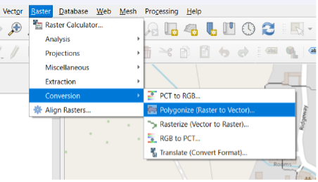

2.  Right-hand click make permanent

<!-- -->

9.  **Run QGis python on vectors to thicken and close gaps**

> Open the python console:
>
> 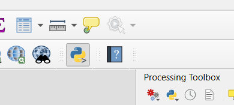
>
> Open Phase1\\bin\\ReadCSVtoPolygon\_1.py

10. **Import Polygon into QGIS**

\\\\Layer, Data Source Manager =&gt; As below

> 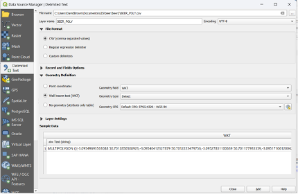

Accept defaults!


## Manual approach

How to use QGIS to generate a map polygon from PDF map.

Using OSM Standard (Open Street Map) as layer to identify coordinates

Using Honiton as an example
<https://eastdevon.gov.uk/media/560777/honitoncaa.pdf>

1.  Identify ‘best’ map from available maps. I used the criteria of
    clearest outline, a legend which doesn’t cover the outline or
    significant portions of the map, and less artifacts in the map.
1.  Copy and paste into a .jpeg file (using snipping tool) and if
    necessary, rotate so north is upwards.
    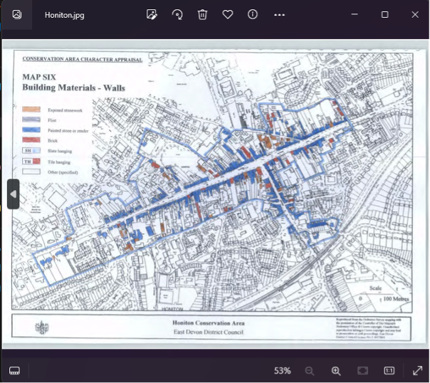

1.  Import into QGIS using the Georeferencer tool (Layer,
    Georeferencer).

1.  Map at least 6 points from the picture onto the world map to ensure
    it maps correctly. I find using road junctions, bridges, and corners
    of fields work well. With OS maps as the source and OSM as the
    target, the transformation type should be Projective.
    
    
    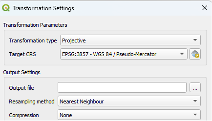

1.  Confirm the maps are lined up using transparency, matching roads and
    other landmarks.
1.  Create a new vector layer and using the edit, add polygon feature,
    trace the
    outline.
    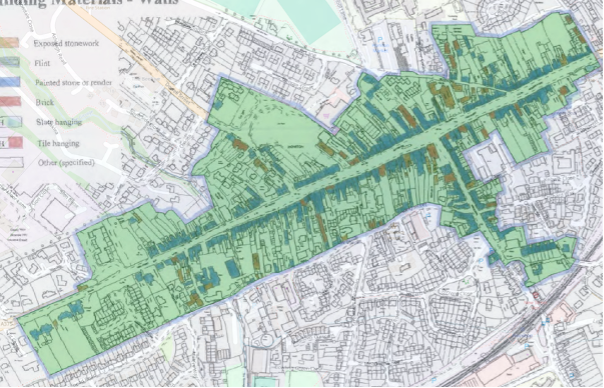
1.  Export the polygon as a csv using the geometry
    AS\_WKT.
    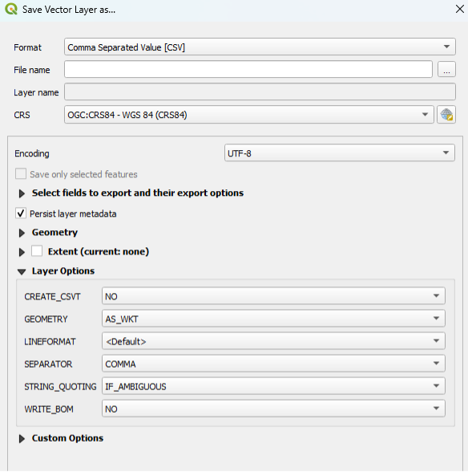
1.  This gives you a text file where you can get the MULTIPOLYGON
    definition of the polygon.

Consideration needs to be given to where on the line the actual border
is. Some areas use a thick line which can be outside, inside or across
the border. Usually it is obvious which but care must be taken as it can
vary depending on the policies of the LPA who look after the data.